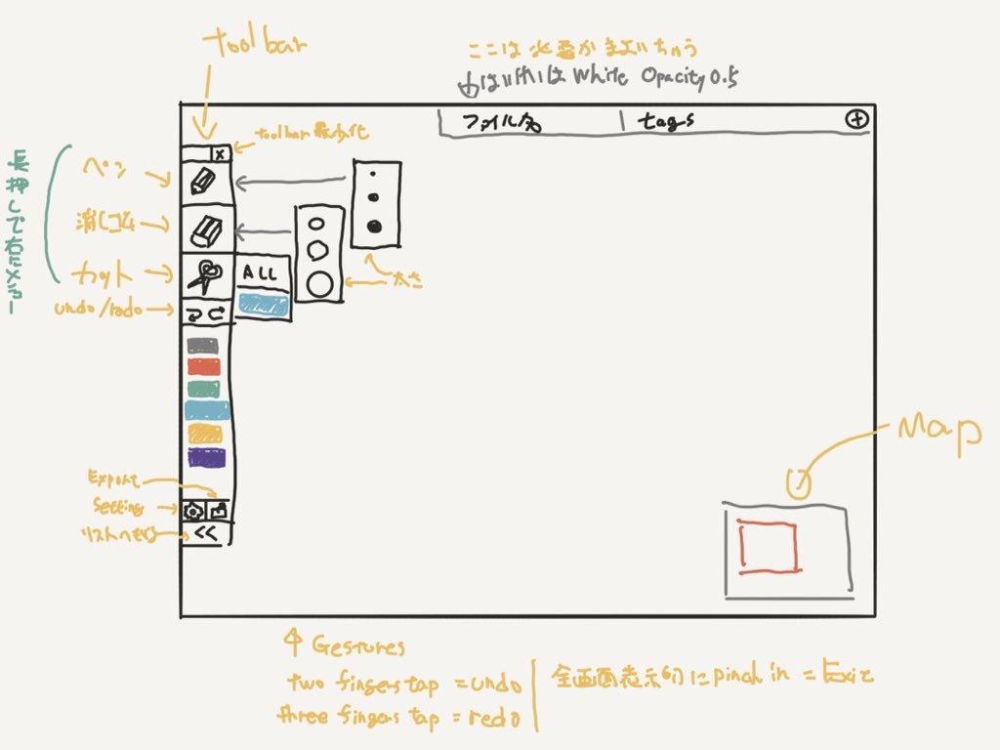

# SS

2017/12/24

# 目的
## 手書き部
- メモを取ったり、脳内の整理をしやすい手書きメモアプリを作る
 - レイヤー機能の代わりに指定色を消せる消しゴム機能を持つ [Proof of Concept](https://github.com/masuidrive/colored_eraser)

## リスト部
- メモをファイル名以外の方法で管理する
 - 書いたメモをカレンダーと組み合わせて管理できる

# masuidrive
- [制作ブログ](https://note.mu/masuidrive/m/m353cf43d8dc9)
- 増井が書いたラフ
 - 
 - 

## CanvasToolbarコンポーネント
- [ドキュメント](https://tmokita.github.io/ColorPenMemo/CanvasToolbar)
- お絵かき部の左に出るツールバーを提供するPod
- 責任範囲を切り分けるために切り出した

### TODO
- 現在のペンの太さをアイコンの右下に表示
- 画像ボタンのsubmenu実装
- orientationが変わった時に位置変更
- submenu出したときに範囲外をタップで閉じる
- 最小化ボタンと最小化を実装
- 設定に何を入れるか考える
- menuのlong pressの押し心地を調整